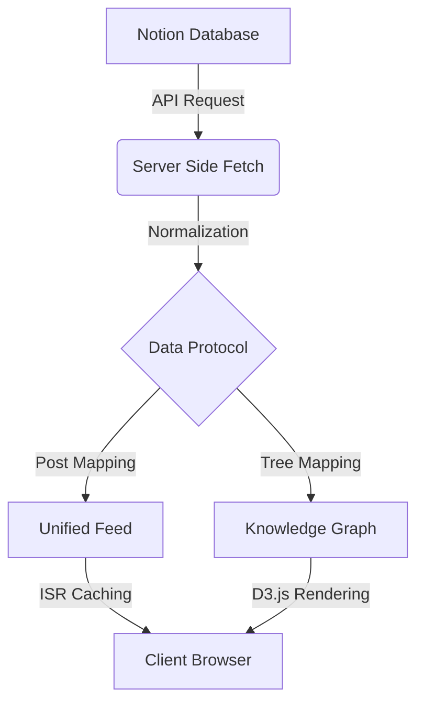

<p align="center">
  
</p>

<h1 align="center">🌌 TENSOR THROTTLE X Space</h1>

<p align="center">
  An experimental, cinematic portfolio lab — not built to showcase flawless implementations, but to process and externalize ungathered thought.
</p>

<p align="center">
  It transforms raw reasoning into visible structure, layering narrative, motion, and spatial depth to make ideas tangible rather than abstract.
</p>

<p align="center">
  It is less a showcase of outcomes and more a system for thinking in public.<br/>
  <em>Not perfection — but evolution.</em>
</p>

---

## 🧠 Core Principles: Beyond the Standard Portfolio

Unlike a traditional web portfolio which acts as a static gallery of past achievements, **TENSOR THROTTLE X** is designed as a **Live Cognitive Environment**. It departs from standard portfolio conventions in three fundamental ways:

1.  **Process over Outcome**: Most portfolios show only the finished, polished product. This system captures the evolution of thought—documenting the logic, the failures, and the raw technical journeys.
2.  **Atmospheric Cognition**: The use of cinematic loops and spatial audio creates a "Laboratory Mode" of focus. The immersive environment transitions the viewer from passive observation to active exploration.
3.  **Dimensional Structure**: While standard portfolios use flat layouts, this system uses a multi-layer visual stack (Atmosphere, Substrate, Cognition) to mimic the way the human mind layers information.

---

## 🏛️ System Architecture

TENSOR THROTTLE X is built on a **Three-Layer Visual Stack** — a deliberate separation of atmosphere, structure, and cognition. The visual system functions as a cognitive scaffold that gives dimensional presence to abstract reasoning.

### 👁️ Visual Strategy: The Three-Layer Stack


- **Layer 0 (Atmosphere)**: High-definition cinematic background video (`/public/background.mp4`) with recursive loops — representing continuous cognitive motion.
- **Layer 1 (Substrate)**: Translucent glass overlays (`backdrop-blur-xl`) preserving depth while creating structural separation.
- **Layer 2 (Cognition)**: High-density content panels, interactive knowledge trees, and the **SECURE_SHELL** terminal interface — where fragmented ideas become organized systems.

### ⛓️ Data Flow Protocol



The pipeline converts thought fragments stored in Notion into normalized structural outputs — rendered either as narrative streams or spatial knowledge graphs.

---

## 🏗️ Core Modules

### Unified Feed
A centralized stream of thoughts, experiments, and evolving systems — documenting reasoning before resolution.

### Cognitive Dashboard
Three perception modes:
- **NORMAL** → Full cinematic immersion.
- **BRIGHT** → High-clarity Engineering Lab mode.
- **DARK** → Deep-focus mode with suspended atmospheric motion.

### Interactive Tree
A D3-powered branching visualization mapping technical journeys and philosophical evolution.

### Secure Shell
A command-line interface enabling system-wide navigation and hidden overrides.

---

## 🛠️ Technical Implementation

<p align="left">
  
  
  
  
  
</p>

The stack is optimized for clarity, modularity, and visual density.

### Frontend Stack
- **Framework**: Next.js 16 (App Router)
- **Styling**: Vanilla CSS Variables + Tailwind CSS 4.0
- **Animations**: Framer Motion (Micro-interactions & orchestration)
- **Visual Engine**: D3.js (Complex knowledge visualizations)

### Integration Layer
- **CMS**: Notion SDK (`@notionhq/client`)
- **Database**: Supabase (PostgreSQL) for comments & engagement metrics
- **Audio**: Global Spatial Audio system for ambient immersion

---

## 🚀 Deployment & Environment

### Environment Variables
Never commit credentials. Configure in Vercel:

```bash
# Notion Integration
NOTION_TOKEN=ntn_...
NOTION_DATABASE_ID=...

# Supabase (Comments & Analytics)
NEXT_PUBLIC_SUPABASE_URL=...
NEXT_PUBLIC_SUPABASE_ANON_KEY=...
```

### Local Setup
1. **Install dependencies**:
   ```bash
   pnpm install
   ```
2. **Configure environment**:
   Create `.env.local` with the variables above.
3. **Run laboratory**:
   ```bash
   pnpm dev
   ```

---

## 🔐 Security & Privacy
- Robust `.gitignore` protecting `.env` variants and build artifacts.
- Rate-limited secure communication channel.
- API-level protection for engagement modules.

---

## 📜 Documentation Index
- [Visual Guide](./VISUAL_GUIDE.md)
- [Design System](./DESIGN_SYSTEM.md)
- [Setup Guide](./SETUP.md)

---

<p align="center">
Developed with structural intent and atmospheric precision for <strong>TensorThrottle X</strong>.
</p>
