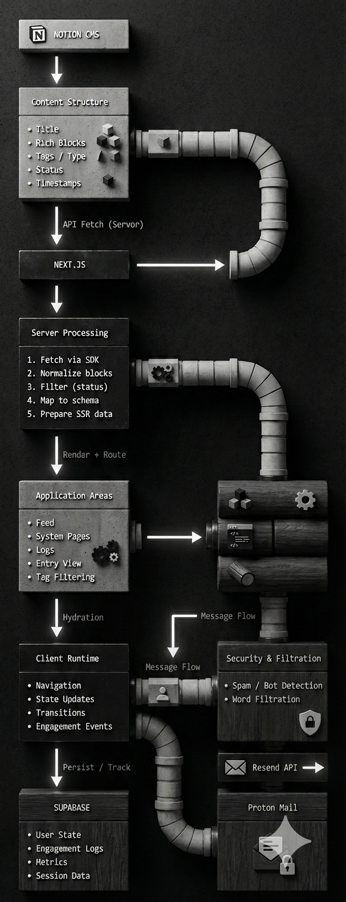

<!-- TX HERO -->
<h1 align="center">
  
  TENSOR THROTTLE X Space
</h1>

<h3 align="center">
  A cognitive sandbox for structured experimentation.<br>
  Not a portfolio. Not a product. Just a system for thinking out loud.
</h3>


<p align="center">
  
</p>


---

# Alternates

alt links : https://tensorthrottlexspace.vercel.app/ <br></br>
alt links : https://www.tensorthrottlex.in/

#

# 🧭 What This Is ?

Tensor Throttle X Space is a live reasoning space.

It exists to:

- Capture incomplete ideas  
- Test evolving technical structures  
- Document failures and refactors  
- Track how thinking changes over time  

This platform/space prioritizes **process over presentation**.

There are no polished case studies here.  
Only iteration.

---


# 🛑 Why Not A Portfolio ?

Portfolios are static museums of finished work. They prioritize polish over process, often hiding the messy reality of engineering. 

This space exists to invert that model. 

By exposing the raw lifecycle of ideas—from inception to refactor to failure—it serves as a dynamic record of cognition rather than a curated gallery of assets. It is a living system, not a brochure.

---


# 🔁 The Core Loop

At its simplest, the system follows this cycle:

↺ Idea → Draft → Break → Refactor → Log → Repeat ↻


Everything here lives somewhere inside that loop.

---

# 🌊 Data Flow (How Things Move)

Instead of rigid architecture diagrams, here’s the actual flow:

 

### In plain terms:

- Thoughts live in Notion.
- Next.js pulls and renders them.
- The UI frames them.
- Interaction generates state.
- Supabase stores that state.
- The cycle continues.

---

# 🧱 Internal Structure

Think of the system in three zones:

Atmosphere → sets mood
Structure → frames content
Cognition → actual thinking


Or visually:

Cinematic Background
↓
Glass / Layout Frame
↓
Notes · Code · Experiments · Logs


No heavy abstraction. Just separation of responsibility.

---

# 🧠 Philosophy

### Raw > Polished
Messy drafts reveal architecture.

### Iteration > Completion
Systems are allowed to break.

### Visible Thinking
Abstract ideas should be navigable.

---

# ⚙️ Stack


- **Next.js 16** — routing + rendering  
- **Tailwind CSS 4** — structural styling  
- **Notion API** — raw thought storage  
- **Supabase** — interaction persistence  


Chosen for flexibility and iteration speed.

---

# 🚀 Running Locally

```bash
pnpm install
pnpm dev
```


# 🧭 Positioning

This is not:

A portfolio

A startup landing page

A finished product

This is:

A cognitive test space

A structural thinking lab

A system under constant refactor

Built for evolution.  
Not presentation.

<h4 align="center">

 
</h4>

© 2026 Tensor Throttle X. A cognitive sandbox.
