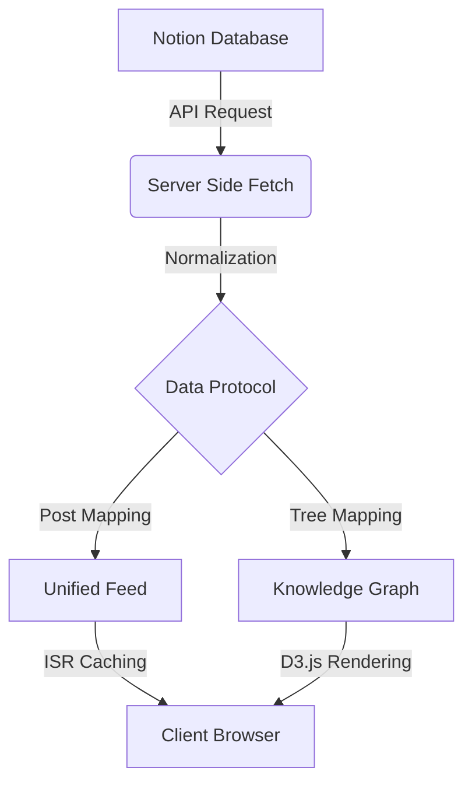

# 🌌 TENSOR THROTTLE X (space)

An experimental, cinematic portfolio lab powered by **Next.js 16**, **Notion CMS**, and **D3.js**. Designed for high-clarity engineering documentation and immersive visual storytelling.

[](https://nextjs.org/)
[](https://react.dev/)
[](https://tailwindcss.com/)
[](https://notion.so/)
[](https://supabase.com/)

---

## 🏛️ System Architecture

`TENSOR THROTTLE X` is built on a **Three-Layer Visual Stack** designed to separate atmospheric immersion from functional data density.

### 1. Visual Strategy: The Three-Layer Stack
- **Layer 0 (Atmosphere)**: High-definition cinematic background video (`/public/background.mp4`) with recursive loops.
- **Layer 1 (Substrate)**: Translucent glass overlays (`backdrop-blur-xl`) that provide contrast while preserving depth.
- **Layer 2 (Cognition)**: High-density content panels, interactive knowledge trees, and the `SECURE_SHELL` terminal interface.

### 2. Data Flow Protocol


### 3. Core Modules
- **Unified Feed**: A centralized stream of thoughts, projects, and experiments fetched directly from Notion.
- **Cognitive Dashboard**: The main entry point featuring three distinct viewing modes:
  - `NORMAL`: Cinematic experience with full video background.
  - `BRIGHT`: High-clarity "Engineering Lab" mode (inverted/matte).
  - `DARK`: Deep focus mode with suspended video for zero distraction.
- **Interactive Tree**: A D3-powered branching visualization for mapping technical journeys and philosophies.
- **Secure Shell**: A command-line interface for system-wide navigation and secret overrides.

---

## 🛠️ Technical Implementation

### Frontend Stack
- **Framework**: Next.js 16 (App Router)
- **Styling**: Vanilla CSS Variables + Tailwind CSS 4.0
- **Animations**: Framer Motion (Orchestration & Micro-interactions)
- **Visuals**: D3.js (Complex data visualizations)

### Integration Layer
- **CMS**: Notion SDK (Official `@notionhq/client`)
- **Database**: Supabase (PostgreSQL) for real-time commenting and engagement metrics.
- **Audio**: Global Spatial Audio system for ambient atmosphere.

---

## 🚀 Deployment & Environment

### Environment Variables
To prevent credential leaks, ensure the following are set in your deployment environment (Vercel) and **never** committed to Git.

```bash
# Notion Integration
NOTION_TOKEN=ntn_...
NOTION_DATABASE_ID=...

# Supabase (Comments & Analytics)
NEXT_PUBLIC_SUPABASE_URL=...
NEXT_PUBLIC_SUPABASE_ANON_KEY=...
```

### Local Setup
1. **Clone & Install**:
   ```bash
   pnpm install
   ```
2. **Configure Environment**:
   Duplicate `.env.example` (if present) to `.env.local` and add your keys.
3. **Run Laboratory**:
   ```bash
   pnpm dev
   ```

---

## 🔐 Security & Privacy
- **Credential Protection**: The project is pre-configured with a robust `.gitignore` blocking all `.env` variants, IDE settings, and build artifacts.
- **Secure Channel**: Direct communication is routed through a rate-limited secure link to prevent spam/abuse.
- **Rate Limiting**: Integrated API protection for message transmission and commenting.

---

## 📜 Documentation Index
- [Visual Guide](./VISUAL_GUIDE.md) - Layout & UI mapping
- [Design System](./DESIGN_SYSTEM.md) - Typography & Tokenomics
- [Setup Guide](./SETUP.md) - First-time installation details

---

Developed with absolute precision for **TensorThrottle X**.
