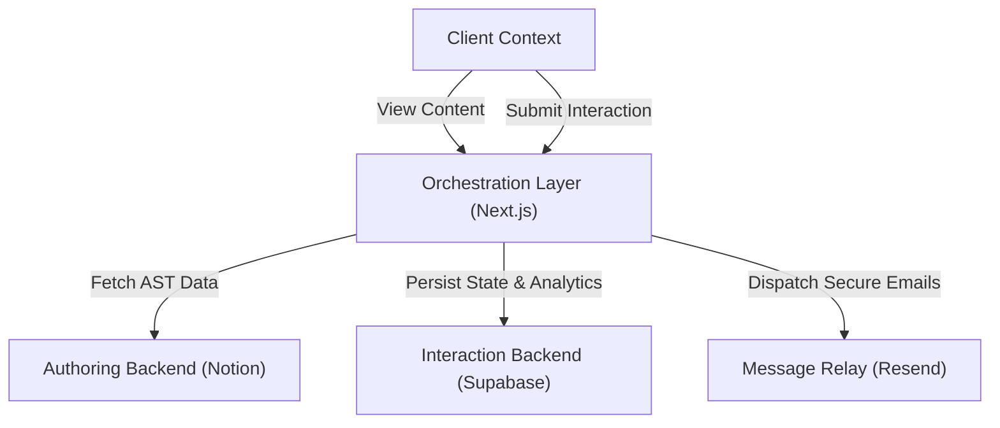
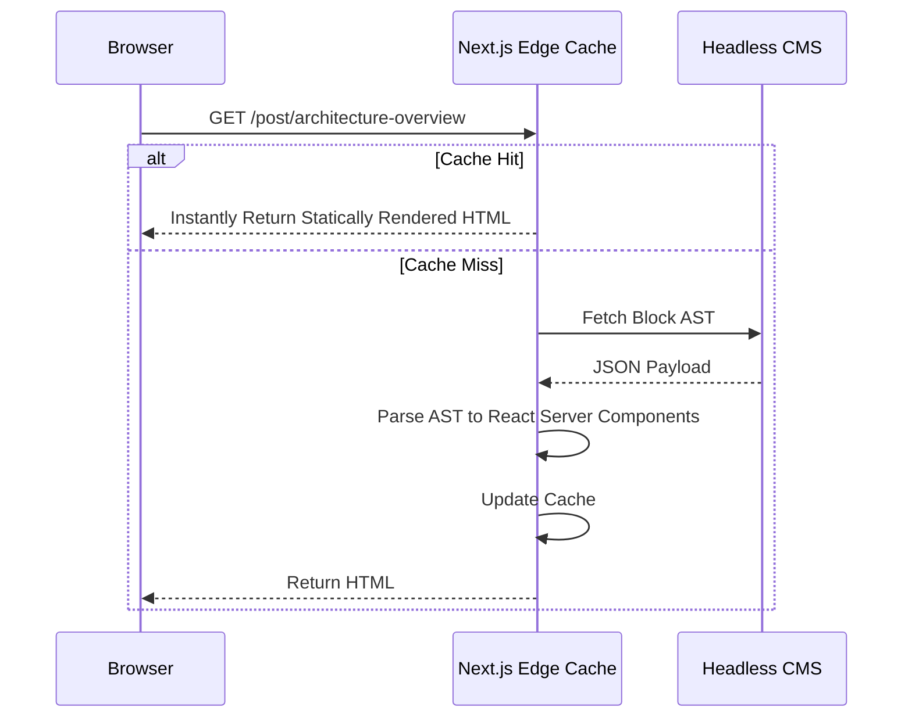
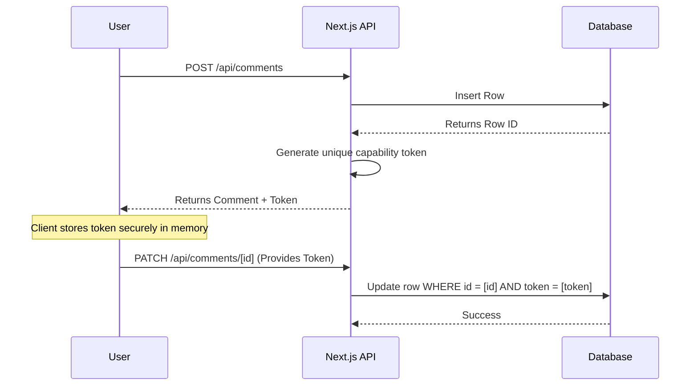
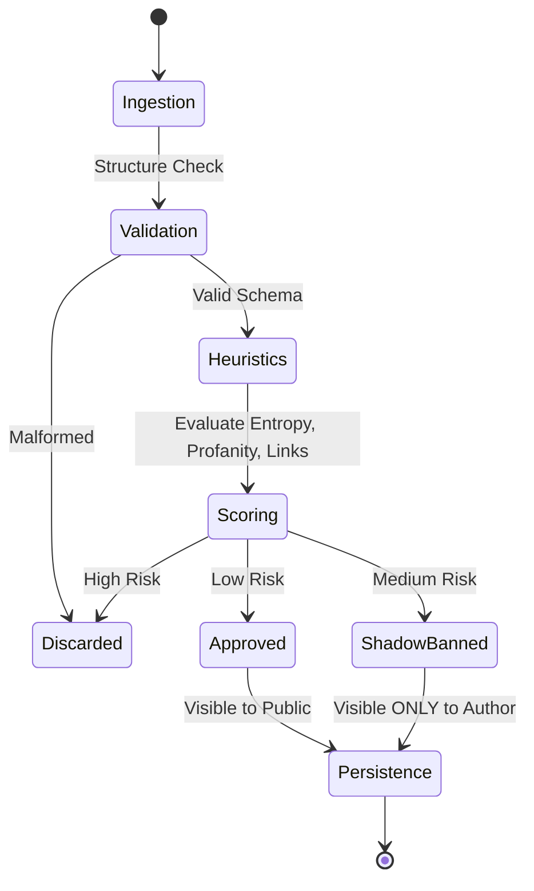

# The Architecture of TensorThrottle X Space

This is not a traditional repository landing page. 

It is an engineering journal. A technical documentary of a system built to challenge the friction of modern digital interaction.

If you are looking for a feature list, you will not find one here. Instead, this document explains what TensorThrottle X Space is, why it was built, and how the architecture evolved to support its exact requirements.

## What is this?

TensorThrottle X Space is a cognitive sandbox and a decentralized interaction engine. 

It acts as a live reasoning space where thoughts are authored elsewhere, rendered dynamically at the edge, and discussed anonymously without the requirement of user accounts. It is a system designed for thinking out loud, engineered to prioritize process over presentation.

## Why does it exist?

Conventional content platforms force a binary choice: either lock discussions behind a mandatory account wall to prevent spam, or allow open anonymity and drown in abuse. Furthermore, most systems tightly couple the authoring database with the presentation layer, creating monolithic structures that are difficult to scale and slow to render.

TensorThrottle X exists to reject both compromises. It explores how far a decoupled architecture can go when identity is stripped away and replaced with cryptographic capabilities.

## What problem does it challenge?

The primary engineering challenge was decoupling reading from interaction.

Publishing content and storing community activity are two fundamentally different responsibilities. Content is read-heavy, cacheable, and easily distributed to edge networks. Interaction is write-heavy, highly dynamic, and requires strict validation. Combining them into a single database creates bottlenecks.

The problem was to design a system where content delivery never blocks on database writes, and where an anonymous user can hold a persistent, stateful conversation without ever trading their personal information for an account.

## How did the architecture evolve?

Initially, the concept was simple: a standard web application connected to a single database.

But as the requirement for a frictionless authoring experience grew, the rendering layer needed to disappear into the background. The content—not the framework—had to become the focus. This led to the decision to use Notion as a headless CMS. 

However, Notion cannot handle rapid, concurrent, public writes for a discussion board. Thus, the system split. Next.js became the orchestrator, pulling static content from Notion at build-time or edge-time, while pushing dynamic user interactions to a separate, highly defensive PostgreSQL database (Supabase).

## What principles guided every decision?

Every architectural choice was weighed against three non-negotiable principles:

1. **Anonymity over Identity:** Identity must be ephemeral. Users are defined by browser fingerprints and cryptographic tokens, never by email addresses or passwords.
2. **Defensive Isolation:** Because every interaction is anonymous, every input must be treated as hostile. The database must never trust the client, and the API must aggressively scrub data before returning it.
3. **Decoupled Rendering:** Content delivery must survive even if the interaction database goes offline. 

## How does the system actually work?

The system operates as an orchestration layer between isolated backends.


```mermaid
graph TD
    Client["Client Context"]
    NextJS["Orchestration Layer (Next.js)"]
    CMS["Authoring Backend (Notion)"]
    Database["Interaction Backend (Supabase)"]
    Relay["Message Relay (Resend)"]
    
    Client -->|View Content| NextJS
    Client -->|Submit Interaction| NextJS
    
    NextJS -->|Fetch AST Data| CMS
    NextJS -->|Persist State & Analytics| Database
    NextJS -->|Dispatch Secure Emails| Relay
```

By isolating the CMS from the interaction database, the platform guarantees that spikes in read traffic do not contend with write traffic at the database layer.

## How does a request travel?

When a user visits a page, the framework avoids rendering rich text on the client.


```mermaid
sequenceDiagram
    participant Browser
    participant Server as Next.js Edge Cache
    participant CMS as Headless CMS
    
    Browser->>Server: GET /post/architecture-overview
    alt Cache Hit
        Server-->>Browser: Instantly Return Statically Rendered HTML
    else Cache Miss
        Server->>CMS: Fetch Block AST
        CMS-->>Server: JSON Payload
        Server->>Server: Parse AST to React Server Components
        Server->>Server: Update Cache
        Server-->>Browser: Return HTML
    end
```

This decision was made to shift the heavy lifting of parsing complex document structures away from the user's device. The trade-off is a heavier reliance on server-side compute during cache misses, but the result is a drastically reduced JavaScript payload and near-instant Time to Interactive (TTI).

## How does a discussion travel?

When discussions became more than replies beneath a post, a flat comment model stopped being enough. The discussion engine gradually evolved into a hierarchical threaded system. 

But without user accounts, how does a user edit or delete their own comment?

The solution was capability-based security.


```mermaid
sequenceDiagram
    participant User
    participant API as Next.js API
    participant DB as Database
    
    User->>API: POST /api/comments
    API->>DB: Insert Row
    DB-->>API: Returns Row ID
    API->>API: Generate unique capability token
    API-->>User: Returns Comment + Token
    Note over User: Client stores token securely in memory
    
    User->>API: PATCH /api/comments/[id] (Provides Token)
    API->>DB: Update row WHERE id = [id] AND token = [token]
    DB-->>API: Success
```

This transfers state management entirely to the client. If the user loses the token, they lose ownership of the comment. This was a deliberate trade-off: absolute anonymity in exchange for client-side state responsibility.

## How does moderation work?

To survive on the open internet without user accounts, the system required an automated, synchronous moderation pipeline. 

Instead of rejecting all suspicious content outright—which allows attackers to reverse-engineer the filters—the system utilizes a shadow-ban architecture.


```mermaid
stateDiagram-v2
    [*] --> Ingestion
    Ingestion --> Validation: Structure Check
    
    Validation --> Discarded: Malformed
    Validation --> Heuristics: Valid Schema
    
    Heuristics --> Scoring: Evaluate Entropy, Profanity, Links
    
    Scoring --> Approved: Low Risk
    Scoring --> ShadowBanned: Medium Risk
    Scoring --> Discarded: High Risk
    
    Approved --> Persistence: Visible to Public
    ShadowBanned --> Persistence: Visible ONLY to Author
    
    Persistence --> [*]
```

Shadow-banned content is persisted so the API can return a successful HTTP response to the client. The attacker believes their spam succeeded, but the database flags it, and the read queries silently filter it out for everyone else.

## How is data protected?

Data protection was designed with the assumption that the API could eventually be compromised. 

1. **Row Level Security (RLS)**: The database enforces read permissions at the row level. Even if the backend API is exploited, the anonymous role can only select non-deleted, active rows.
2. **Layered Rate Limiting**: An in-memory sliding window provides immediate rejection of automated bursts, while a persistent database query ensures limits survive serverless cold starts.
3. **Aggressive Scrubbing**: The database tracks IP addresses for administrative banning, but the API actively intercepts and scrubs this data before any row is returned to the public, ensuring no PII is ever leaked to the client.

## Why is the repository organized this way?

The directory structure directly mirrors the separation of concerns forced by the architecture.

```text
.
├── app/                  # The Next.js orchestration and rendering layer
├── components/           # Pure, stateless UI presentation components
├── lib/                  # Framework-agnostic business logic and defensive pipelines
├── scripts/              # Ephemeral developer tooling
└── supabase/
    └── migrations/       # The immutable, sequential history of the database schema
```

The database schema is strictly managed via timestamped SQL migrations. Manual database edits are forbidden. This ensures that the production database can be rebuilt entirely from the repository state at any moment.

## How does someone contribute?

Contributions are expected to respect the boundaries established by the architecture. 

Code should not cross domain lines. Presentation logic remains in `components/`. Orchestration remains in `app/`. Defensive logic and data access remain in `lib/`. 

All database changes must be proposed as idempotent, forward-only SQL migrations. Schema drift is treated as a critical failure.

## Where is the project heading?

TensorThrottle X is a stable foundation, but it is not finished. The architecture was designed to support extensions that are not yet implemented.

In the future, heuristic moderation will be replaced by asynchronous large language models capable of contextual sentiment analysis. The static search will be replaced by vector embeddings and semantic routing. The ephemeral fingerprints will evolve into a persistent, zero-knowledge trust system, allowing anonymous users to build reputation over time without ever revealing who they are.

This repository is the record of that ongoing evolution.
