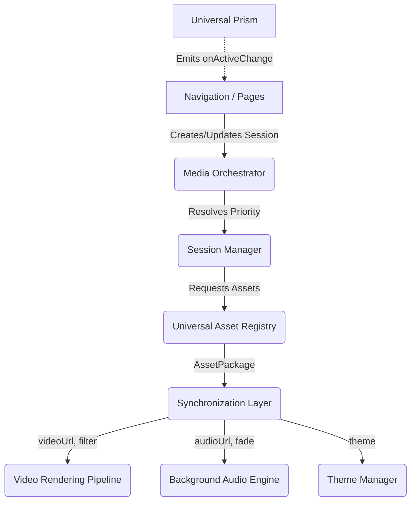
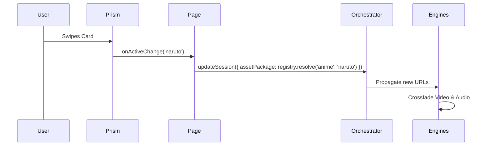

# Universal Session-Based Media Platform
## The Definitive Engineering Handbook

This document serves as the official source of truth for the Universal Session-Based Media Platform powering TensorThrottle X Space. It outlines the vision, architecture, APIs, and guidelines required to implement, maintain, and extend the media infrastructure across the entire ecosystem.

---

## 1. Vision

**Why this platform exists**
Before the Universal Media Platform, TensorThrottle X Space suffered from scattered, page-specific media implementations. The Anime Page, Home Page, and Roadmap each maintained their own video players, audio instances, and state managers. This caused race conditions, memory leaks, and overlapping audio. This platform exists to unify all media under a single, highly-performant orchestration layer.

**Problems it solves**
- **Memory Leaks:** Eliminates zombie video tags left in the DOM after page transitions.
- **Audio Overlaps:** Prevents multiple page routes from playing audio simultaneously.
- **Duplicate Logic:** Centralizes hardware detection, resolution scaling, and cinematic filtering.
- **Context Loss:** Enables continuous ambient playback while navigating between standard pages.

**Long-term goals & Scalability objectives**
To support an infinite number of "Dimensions" (Anime, Movies, Games, AI) with zero additional media boilerplate. The platform is designed to scale to spatial audio, AR/VR experiences, and collaborative syncing without rewriting the base orchestration layer.

---

## 2. High-Level Architecture

The architecture relies on a unidirectional orchestration flow. Pages do not render media; they request it.



**Layers Explanation:**
1. **Navigation/Pages:** Consumers of the platform. They declare what they want to play.
2. **Universal Prism:** Media-agnostic interaction tier. Swiping the prism tells the page to update the session.
3. **Media Orchestrator:** The React Context boundary that holds the active state.
4. **Session Manager:** Evaluates the stack of active sessions and promotes the highest priority.
5. **Universal Asset Registry:** Converts standard dimensions/IDs into absolute URLs.
6. **Engines:** The low-level DOM wrappers that execute the media playback securely.

---

## 3. Core Design Principles

- **Single Responsibility:** Engines play media. Registries resolve paths. Orchestrators manage state. Never mix these.
- **Loose Coupling:** The Universal Prism does not know what a video is. It only knows IDs and angles.
- **Session Ownership:** Components own their sessions. When a component dies, its session dies, naturally restoring the previous state.
- **Priority Resolution:** Avoids explicit "pause this, play that" logic. By giving Fullscreen a priority of 100 and Background a priority of 10, the orchestrator handles the math automatically.
- **Platform First:** Build for the platform, not the page. If a feature is needed for the Anime page, it must be built as a capability of the Universal Platform.

---

## 4. Complete Module Documentation

### Media Orchestrator (`MediaOrchestrator.tsx`)
- **Purpose:** Acts as the central nervous system.
- **Responsibilities:** Maintains the `Map` of active sessions, calculates the active session via priority, and passes the resulting `AssetPackage` to the Engines.
- **Lifecycle:** Global. Lives at the root of the app (`app/layout.tsx`).

### Universal Asset Registry (`UniversalAssetRegistry.ts`)
- **Purpose:** Single source of truth for file paths.
- **Responsibilities:** Takes `(dimension, id)` and returns a structured `AssetPackage`.
- **Public API:** `assetRegistry.resolve(dimension, id)`

### Video Rendering Pipeline (`VideoRenderingPipeline.tsx`)
- **Purpose:** Secure, hardware-accelerated video playback.
- **Responsibilities:** Applies Cinematic Filters, limits resolution based on Device Profiles, and utilizes CSS hardware-accelerated transforms for orientation logic.

### Background Audio Engine (`BackgroundAudioEngine.tsx`)
- **Purpose:** Ambient sound control.
- **Responsibilities:** Crossfading between tracks cleanly. Never stops abruptly.

### Theme Manager
- **Responsibilities:** Syncs `AssetPackage.theme` to the DOM (`data-theme="dark"`).

---

## 5. Folder Structure

```text
lib/
 └── media/
      └── UniversalAssetRegistry.ts    (Asset resolution logic)

components/
 ├── providers/
 │    └── MediaOrchestrator.tsx        (Session state & Global layout wrapper)
 │
 ├── media/
 │    ├── BackgroundVideoEngine/       (Low-level video DOM & crossfading)
 │    ├── BackgroundAudioEngine/       (Low-level audio crossfading)
 │    ├── VideoRenderingPipeline.tsx   (Device scaling, cinematic filters)
 │    └── AdaptiveMediaRenderer.tsx    (Fallback rendering for non-video)
```

**Allowed Dependencies:** Engines may depend on Utilities. Orchestrators may depend on Engines. Engines MUST NEVER depend on Orchestrators.

---

## 6. Asset Architecture

Assets are stored predictably without hardcoded paths in the UI.

**Folder Convention:**
`/public/media/universe/{dimension}/video/{id}/{id}.mp4`
`/public/media/universe/{dimension}/audio/{id}/{id}.mp3`

**Asset Packages:**
Every resolution yields an `AssetPackage`:
```typescript
interface AssetPackage {
  id: string
  dimension: string
  videoUrl: string | null
  audioUrl: string | null
  coverUrl: string | null
  theme: 'dark' | 'bright' | 'dynamic'
}
```

---

## 7. Media Session System

The core paradigm shift from imperative commands to declarative states.

- **Global Sessions (Priority 10):** Owned by the Bottom Navigation. Always present as a fallback.
- **Scoped Sessions (Priority 50):** Owned by immersive pages (e.g., Anime Universe). While the user is on the page, this session overtakes the Global session.
- **Overlay/Fullscreen (Priority 100+):** Owned by cinematic modals.

**Restoration:** When a user clicks "Back" from the Anime page, the page unmounts, destroying its Priority 50 session. The Orchestrator automatically steps down to Priority 10, resuming the global background smoothly.

---

## 8. Video Engine

The Video Rendering Pipeline handles severe hardware optimizations.

- **Device Detection & Resolution Guard:** Caps 4K videos to 720p on low-end mobile devices using CSS `transform: scale()` downscaling to trick the compositor.
- **Orientation Detection:** Reads MP4 `tkhd` matrix atoms to auto-landscape vertical videos.
- **Cinematic Filters:** Applies `brightness`, `contrast`, and `saturate` dynamically based on the hardware tier to maintain 60FPS.

---

## 9. Audio Engine

- **Crossfade Engine:** Audio tracks are faded using a 40ms interval step function. Volume eases from 1.0 down to 0, swaps the `src`, and fades back to target volume (e.g., 0.35).
- **Playback Policies:** Strict enforcement of muted auto-play until user interaction is detected.

---

## 10. Theme System

Theme is an inherent property of media. Changing media changes the theme.
- A bright video asserts `theme: 'bright'`. The Orchestrator applies this to the root `<html>` tag, instantly adapting the entire UI (fonts, borders, overlays) without manual intervention.

---

## 11. Runtime Flow

**Prism Rotation Sequence:**


---

## 12. Event Architecture

The platform minimizes Event Buses in favor of React Context for reactivity. However, fatal errors (e.g., Audio Context blocked) are emitted upward so the UI can prompt the user.

---

## 13. Public APIs

**React Hook:**
```tsx
const { updateSession } = useMediaSession({
  scope: 'anime-universe',
  priority: 50,
  mode: 'SCOPED_BACKGROUND',
  assetPackage: assetRegistry.resolve('anime', 'dragonball')
})
```
*Responsibility:* Automatically registers the session on mount and destroys it on unmount.

---

## 14. Error Handling

- **Missing Media:** If `videoUrl` 404s, the Engine falls back to the `AdaptiveMediaRenderer` (Image).
- **Unsupported Codec:** Fails gracefully to black/fallback.
- **Memory Limits:** If the browser fires a memory warning, the Resolution Guard throttles the video pipeline to "Low Tier" immediately.

---

## 15. Performance

- **GPU Optimisation:** All video transitions utilize `will-change: transform, opacity` and `backface-visibility: hidden`.
- **Bundle Strategy:** Heavy decoders are lazy-loaded. The orchestrator is extremely lightweight.

---

## 16. Naming Standards

- **Orchestrator:** Manages state and priority (e.g., `MediaOrchestrator`).
- **Pipeline:** A chain of processing logic (e.g., `VideoRenderingPipeline`).
- **Engine:** Low-level DOM API wrappers (e.g., `BackgroundAudioEngine`).
- **Registry:** Lookup tables and factory functions (e.g., `UniversalAssetRegistry`).

---

## 17. Migration Guide

All legacy `MediaProvider`, `SmartVideo`, and local `<audio>` tags are deprecated.
1. Wrap new routes in `useMediaSession`.
2. Do not import `BackgroundVideoEngine` directly into pages.
3. Use `assetRegistry.resolve()` instead of hardcoding `/media/...`.

---

## 18. Testing Strategy

- **Unit Tests:** `UniversalAssetRegistry` must map 100% of dimension IDs correctly.
- **Session Tests:** Mock the `MediaOrchestrator` to ensure Priority 50 overrides Priority 10, and destruction restores Priority 10.
- **Hardware Tests:** Emulate low memory to verify the `ResolutionGuard` triggers.

---

## 19. Future Roadmap

- **Spatial Audio:** Extending the `BackgroundAudioEngine` to support WebAudio API spatial panning based on Prism rotation.
- **Ambient Lighting:** Extracting dominant colors from the video buffer in real-time to cast CSS drop-shadows on the UI.
- **Collaborative Sessions:** Syncing the Orchestrator state over WebSockets for "Watch Party" modes.

---

## 20. Appendix

- **ADR-001:** Universal Media Platform
- **ADR-002:** Session-Based Media
- **Module Ownership Matrix:** The Core Platform Team owns the `lib/media` and `components/providers` directories. Feature teams own the execution of `useMediaSession` within their routes.


---

# 21. Appended Architecture Decision Records (ADRs)\n\n# ADR-001: Universal Media Platform
**Status:** Accepted

**Context:** Multiple pages (Anime, Timeline, Glob) were implementing their own video players, causing audio overlapping and memory leaks.

**Decision:** We will extract all media logic into a centralized Orchestrator that sits at the root of the app. Pages will no longer render media players; they will request media via sessions.

**Consequences:** Easier maintenance, better performance, but requires wrapping new routes in a `useMediaSession` hook.
\n\n# ADR-002: Session-Based Media
**Status:** Accepted

**Context:** Navigating between immersive pages required complex state tracking to pause/resume background videos.

**Decision:** Implement a priority-based session stack. Components "own" a session. Unmounting automatically restores previous sessions.
\n\n# ADR-003: Universal Asset Registry
**Status:** Accepted

**Decision:** All asset paths are resolved via a deterministic factory `assetRegistry.resolve(dimension, id)` rather than hardcoding `/media/universe/.../`.
\n\n# ADR-004: Video Rendering Pipeline
**Status:** Accepted

**Decision:** Abstract the hardware detection, scaling, and orientation logic into a reusable pipeline to ensure all videos run at 60fps across devices.
\n\n# ADR-005: Media Orchestrator
**Status:** Accepted

**Decision:** The Orchestrator controls the `<BackgroundVideoEngine>` and `<BackgroundAudioEngine>`. Feature teams must interface with the Orchestrator, not the engines directly.
\n\n