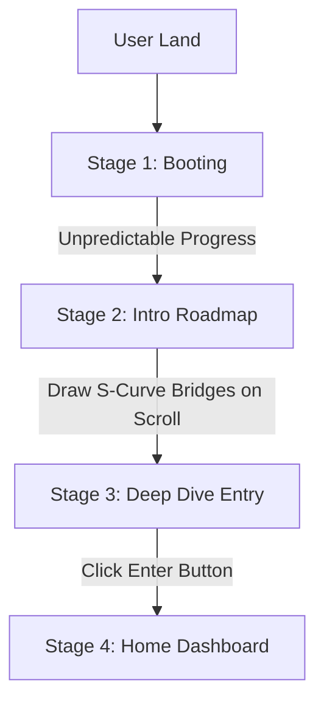

# TensorThrottleX Space — System Flow & Interactive Mechanics

This document provides a comprehensive operational overview of the Entry Sequence, Bootloading flowcharts, and the redesigned Bento Grid Dashboard on the home page.

---

## 1. The Entry Sequence (Bootloader)
The website begins with a multi-stage, high-fidelity entry sequence managed by [BootLoader.tsx](file:///home/tensorttx/Projects/TensorThrottle_X_space/components/visuals/BootLoader.tsx) and driven by global UI states (`isBooting`, `uiMode`, `renderMode`) from the [UIProvider](file:///home/tensorttx/Projects/TensorThrottle_X_space/components/providers/UIProvider.tsx).

### Stage 1: The Initializing Boot Circle (`'booting'`)
- **Visuals**: A deep, pure-black backdrop overlaying the screen. At the center is a glowing cyan logo surrounded by a circular progress border.
- **Mechanics**: The circular border is rendered via SVG pathing with a `strokeDasharray` mapped to a React state. To mimic an authentic operating system boot process, progress increments unpredictably (using random additions between `5%` and `25%` at variable intervals from `150ms` to `700ms`).
- **Transition**: Once progress reaches `100%`, a short `600ms` delay executes, transitioning the sequence state to `'intro'`.

### Stage 2: The Operations Roadmap & S-Curve SVG Bridges (`'intro'`)
- **Visuals**: A cinematic landscape video plays in the background, layered under a blur overlay and dark/bright theme filters. The header slides down displaying the platform brand.
- **Scroll Flowcharts**: A vertical timeline alternates blocks left and right (e.g. *The Spatial Map*, *The Active Shell*, *The Genealogy of Logic*, *The Live Heartbeat*, *The Atmospheric Shift*).
- **SVG Drawing Bridges**:
  - The consecutive flowchart blocks are connected via custom curved SVG path bridges.
  - Utilizing `framer-motion`'s viewport sensors, these paths draw themselves dynamically (animating `pathLength` from `0` to `1`) as they scroll into view, guiding the user's eye through the sequence.

### Stage 3: The Deep-Dive Portal Entry Button (`'done'`)
- **Visuals**: A final summary block displays the system's core vision, leading to a prominent, glowing capsule button.
- **Mechanics**: Hovering over the button triggers a translation and color transition, transforming the text label from `Enter the Space` to `Deep Dive`. Clicking this button sets the bootloader stage to `'done'`, which initiates a global slide-up exit transition, exposing the main home page.

---

Code security
